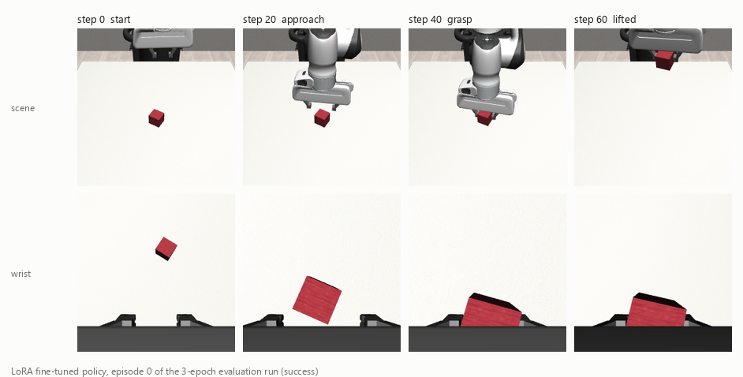
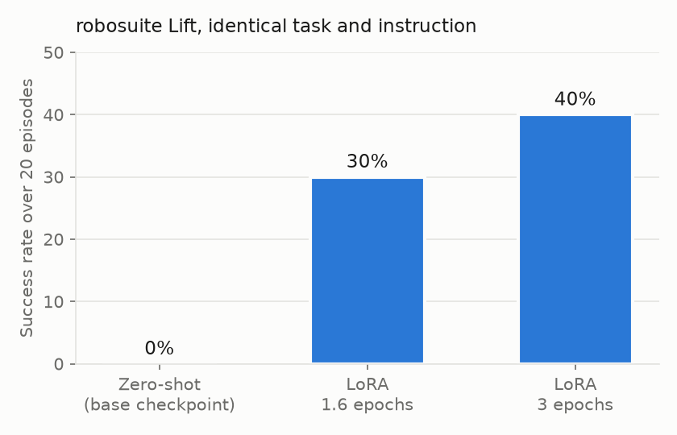
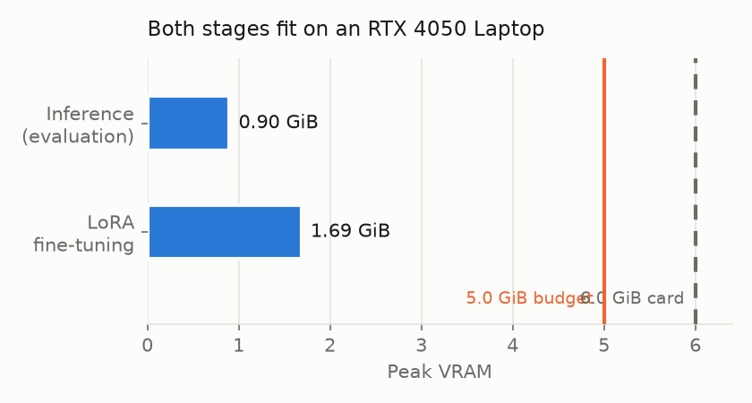
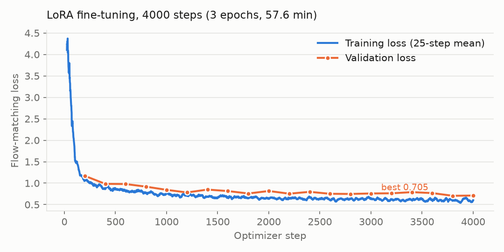

<div align="center">

# Testing SmolVLA

<hr>

Can a 450M-parameter vision-language-action model be fine-tuned and run on consumer
hardware? We measured it end to end: SmolVLA driving a simulated Panda arm on
robosuite `Lift`, from a zero-shot baseline through LoRA fine-tuning.


[Results](#results) ·
[Findings](#seven-findings-that-changed-the-plan) ·
[Reproducing](#reproducing) ·
[Report an issue](https://github.com/luminolous/testing-SmolVLA/issues)

</div>



---

## Results

The fine-tuned policy solves `Lift` in 8 of 20 episodes. The base checkpoint solves
none.

<div align="center">



</div>

| Run | Action mapping | Success | Action clipping | Steps at which success occurred |
| --- | --- | --- | --- | --- |
| Zero-shot base checkpoint | arbitrary, 6→7 | 0% (0/20) | 2.3% | none |
| LoRA, 1.6 epochs | identity, 7→7 | 30% (6/20) | 9.1% | 43, 43, 44, 47, 49, 50 |
| **LoRA, 3 epochs** | identity, 7→7 | **40% (8/20)** | 12.0% | 39, 40, 42, 43, 43, 44, 45, 49 |

The success rate is the weaker half of that table. Look at the last column: every
success lands between step 39 and 50, against an expert demonstration mean of 48.3
steps. The policy reproduces the demonstrated behaviour on the demonstrated
schedule, and at 3 epochs it finishes ahead of the average demonstration. Episodes
that fail never succeed at all within 200 steps. The outcome splits in two.

### Does the model fit?

<div align="center">



</div>

| Stage | Peak VRAM | Share of the 6 GB card | Wall clock |
| --- | --- | --- | --- |
| Inference and evaluation | 0.899 GiB | 15% | 500 ms per 50-action chunk |
| LoRA fine-tuning, 3 epochs | 1.687 GiB | 28% | 57.6 min |
| Dataset regeneration, 200 episodes | negligible | rendering only | 5.8 min |

SmolVLA leaves 72% of the card unused while training. The tight constraint we
planned around turned out to be slack.

### Training

<div align="center">



</div>

Training loss was still descending when the run ended: 0.616 across steps 3000-3500,
then 0.603 across 3500-4000. Validation improved from 0.768 at 1.6 epochs to 0.705 at
3. Better validation loss bought a higher success rate, which behaviour cloning does
not guarantee.

---

## Method

Five phases, each with its own results document under [`docs/`](docs/).

| Phase | What it establishes | Document |
| --- | --- | --- |
| 0 | Environment, offscreen rendering, per-step cost | [phase-0](docs/phase-0/result.md) |
| 1 | SmolVLA's I/O contract, latency, memory | [phase-1](docs/phase-1/result.md) |
| 2 | Observation and action adapters, zero-shot baseline | [phase-2](docs/phase-2/result.md) |
| 3 | robomimic download, image regeneration, LeRobot conversion | [phase-3](docs/phase-3/result.md) |
| 4 | LoRA fine-tuning and evaluation | [phase-4](docs/phase-4/result.md) |
| 5 | Full fine-tuning | assessed as unjustified, see below |

### Setup

| Item | Value |
| --- | --- |
| Model | `lerobot/smolvla_base`, 450.0M parameters |
| Trainable under LoRA | 0.74M (0.165%), rank 16, alpha 32 |
| Simulator | MuJoCo 3.2.7 through robosuite 1.4.1 |
| Task | `Lift`, Panda arm, OSC_POSE controller at 20 Hz |
| Cameras | `robot0_eye_in_hand` (wrist) and `agentview`, 256×256 |
| Data | robomimic Lift proficient-human, 200 episodes, 9 666 frames |
| Instruction | `"lift the cube"` |
| Hardware | RTX 4050 Laptop, 6 GB VRAM, 18 GB RAM, Windows 11 |

---

## Seven findings that changed the plan

Each of these corrected an assumption we started with. Four of them corrected an
assumption **we** had already written down and acted on.

### 1. The base checkpoint speaks a different robot's language

`lerobot/smolvla_base` declares a 6-dimensional action space. Its stored statistics
are named `so100.buffer.action`, with means near `[1.6, 120, 110, 57, -27, 12]` and
standard deviations of 14 to 59. Those magnitudes are absolute joint angles in
degrees for an SO-100 arm: five joints and a gripper.

robosuite `Lift` under OSC_POSE wants 7 values: a normalised delta pose plus a
gripper command. Different dimensionality, different semantics, different robot.
No honest dimension-for-dimension mapping exists, and swapping robots does not
create one, since robosuite ships no 5-DoF arm.

This reframed Phase 2. We ran the zero-shot rollout as an integration test with an
arbitrary mapping documented as such, and recorded the 0% result as a floor rather than as
evidence about SmolVLA. [Phase 1](docs/phase-1/result.md),
[Phase 2](docs/phase-2/result.md)

### 2. Actions leave the stock checkpoint unnormalised, in silence

The checkpoint stores its statistics under dataset-qualified keys. LeRobot's
unnormalizer looks up the bare key `action`, misses, and returns the tensor
untouched at `normalize_processor.py:330`. No exception, no log line.

We confirmed it by measurement rather than by reading: output spans `[-2.96, 1.38]`
as shipped, and `[-152.30, 178.43]` once we bind the statistics. An action that looks
plausible in shape and dtype is wrong in magnitude by 14 to 59 degrees.
[Phase 1](docs/phase-1/result.md)

### 3. A silent no-op on state normalisation drove clipping to 64%

The first smoke rollout clipped 64.3% of action values, with per-dimension means as
far out as -9.3, from a model whose output we had measured at unit scale. Saturated
actions point back at preprocessing, so we went looking there.

The checkpoint declares `STATE: MEAN_STD` and ships no state statistics, so LeRobot
skips state normalisation too. Our adapter was handing the network raw joint angles
spanning ±168 where training had supplied normalised values.

| State fed to the model | Clip rate | `drx` mean | `grip` mean |
| --- | --- | --- | --- |
| Raw degrees | 64.3% | -9.31 | +7.64 |
| Scaled to `[-1, 1]` | 9.9% | -0.99 | +0.21 |

[Phase 2](docs/phase-2/result.md)

### 4. Our image-orientation fix produced upside-down training data

robosuite renders with an OpenGL origin at bottom-left, so raw frames arrive flipped.
We verified that by eye and set `IMAGE_CONVENTION = "opencv"` for the whole process in Phase 2,
reasoning that one setting at the source beats a flip inside the adapter.

robomimic flips every RGB observation itself at `env_robosuite.py:190`. The two
corrections composed, and Phase 3's first regenerated dataset came out inverted:
gripper fingers at the top of the wrist view. The global fix created the exact
desynchronisation it was meant to prevent.

Each consumer now turns frames upright at the point of use. Phase 2's numbers stand,
since the model received upright images under either scheme.
[Phase 3](docs/phase-3/result.md)

### 5. A 20-episode rollout died at episode 10 from a MuJoCo handle leak

The crash named a mesh file that sat on disk the whole time and that episodes 0
through 9 had already loaded. We first blamed robosuite's `hard_reset` and disabled
it, which stopped the crash.

That workaround cost something we did not notice: `Lift` randomises the cube's
**size** in `_load_model()`, which only runs on a hard reset. Twenty baseline
episodes had shared one cube size.

Phase 3 needed 200 resets, so we measured the leak with `psutil` instead of guessing.

| Path | Handles per reset | Outcome |
| --- | --- | --- |
| `hard_reset=True` | +50 | fails at reset 10 |
| `hard_reset=False` | 0 | 60 of 60 fine |
| robomimic's `reset_to(model=…)` | +50 | fails at reset 12 |

The leak is identical with the offscreen renderer on and off, which rules out the GL
context. mujoco 3.1.6 leaks; 3.2.7 and 3.3.0 leak nothing over 20 hard resets. We
pinned 3.2.7, restored `hard_reset=True`, and verified 60 consecutive resets with 60
distinct cube sizes and 60 distinct positions. Re-running the baseline with full
randomisation moved every figure inside noise. [Phase 3](docs/phase-3/result.md)

### 6. Half precision was available all along

Phase 1 concluded that `modeling_smolvla.py:808` forces float32 weights and that
Phase 4's bfloat16 requirement could not be met. A dry run contradicted it: peak VRAM
came in at 1.29 GiB, below what 1.68 GiB of float32 weights allows.

The checkpoint ships mixed precision on purpose. 474 bfloat16 tensors carry the
backbone; 26 float32 tensors carry the flow-matching projections, which is what the
hardcoded upcast requires. Casting to a *uniform* dtype breaks it, in either
direction.

| | Forced float32 | Checkpoint's own mix |
| --- | --- | --- |
| Weight bytes | 1.677 GiB | 0.844 GiB |
| Inference peak VRAM | 1.756 GiB | 0.904 GiB |
| Latency per chunk | 399.7 ms | 353.4 ms |

Half the memory, 12% faster, identical outputs. [Phase 4](docs/phase-4/result.md)

### 7. Our throughput sweep measured the wrong thing twice

We swept micro-batch size with `num_workers=0` and concluded that batch 2 was
optimal, since larger batches cost more per sample. Then an 8-step benchmark showed
`num_workers=2` running at 7.78 s/step against 3.40 for zero workers, which looked
conclusive.

Both readings were artifacts. Windows spawns worker processes rather than forking, so
each one re-imports torch; over 8 steps that startup swamps everything. And the
original sweep ran under a bottleneck we could remove: PNG decoding on the main
thread, not the GPU.

Re-measured over 30 steps at a fixed effective batch of 8:

| Config | s/step |
| --- | --- |
| workers 0, batch 2 × 4 accum | 2.48 |
| workers 2, batch 2 × 4 accum | 1.96 |
| workers 4, batch 2 × 4 accum | 2.78 |
| **workers 2, batch 4 × 2 accum** | **1.89** |
| workers 2, batch 8 × 1 accum | 2.10 |

22% faster per sample than our original settings. Image resolution, the lever that
looked largest, bought 4%: halving SmolVLA's 512×512 SigLIP input moved 3.40 s/step
to 3.25. The vision encoder was never the bottleneck.
[Phase 4](docs/phase-4/result.md)

---

## Windows notes

robosuite, robomimic and LeRobot support Linux and macOS. Getting the stack running
on Windows took four workarounds, all of them in
[`src/envs/robosuite_compat.py`](src/envs/robosuite_compat.py), all idempotent, and
all no-ops elsewhere.

| Failure | Cause | Fix |
| --- | --- | --- |
| `FileNotFoundError: ...robosuite\utils\mujoco.dll` | robosuite opens the DLL from its own directory; the wheel ships it inside the `mujoco` package | Copy it across, re-copying when the MuJoCo version changes |
| `RuntimeError: invalid value for environment variable MUJOCO_GL: egl` | `MUJOCO_GPU_RENDERING=True` forces `egl`, and robosuite's own validator then rejects `egl` on Windows. The default configuration always crashes here | Write `macros_private.py` disabling the flag, leaving `MUJOCO_GL=wgl`. Still GPU-rendered |
| `AttributeError: 'MjData' object has no attribute 'qM'` | mujoco 3.13 renamed `qM` to `M`; robosuite 1.4.1 uses the old name | Pin `mujoco==3.2.7`, above the handle leak and below the rename |
| `RuntimeError: CMake must be installed` building `egl_probe` | robomimic depends on it; it compiles against EGL headers that Windows does not have | Install robomimic with `--no-deps` and register a stub reporting zero EGL devices, which is the correct answer here |

Two more, outside that module:

- **`torchcodec` cannot load its shared library** without a system FFmpeg, and PyAV's
  bundled DLLs carry hashed names its lookup cannot find. We create the LeRobot
  dataset with `use_videos=False` and store PNG frames, so no decoder is ever
  reached. This also costs less disk than the HDF5 intermediate: 0.10 MiB per frame
  against 0.38.
- **robosuite renders on the Intel iGPU** unless the process creates a CUDA context
  first. Measured on `Lift` with two cameras: 46.95 ms per step on the integrated GPU
  against 7.33 ms on the RTX 4050, with p95 following the same ratio. The images come
  back correct either way, which is what makes it worth checking.
  `configure_rendering()` claims the discrete GPU before robosuite builds its
  context.

`nvidia-smi` reporting 0% utilisation and a 210 MHz clock during 600 steps of
sustained rendering is what exposed that last one. An earlier version of
`check_env.py` had queried `GL_RENDERER` from a separate probe context and reported
`NVIDIA`, a real reading that answered the wrong question.

---

## Why we did not attempt full fine-tuning

The Phase 5 brief admits full fine-tuning on one condition:
training loss plateauing high despite a raised rank and unfrozen modules, meaning a
genuine capacity limit. We did not meet it.

| Branch | Applies? |
| --- | --- |
| Loss plateaus high, so underfitting | No. Loss was still falling at 4 000 steps |
| Loss low but rollout success low, so a wiring bug | No. Success went 0% to 40%, and the action statistics converged onto the experts' |
| Both low, success improved but modest, so data quantity | Closest match, at 40% from 3 epochs of 180 demonstrations |

The document names that third case as pointing at data rather than capacity. Going
from 1.6 to 3 epochs bought 10 percentage points, so more of the same data is still
paying.

Cheaper work first:

1. **Train longer.** Loss is still moving and an hour buys 3 epochs.
2. **Investigate `dz`.** The policy commands upward motion at +0.512 against the
   experts' -0.171 and clips 28.9% of the time. Three epochs did not shift it, which
   makes it look structural.
3. **Generate more data with MimicGen**, as Phase 3 anticipated.
4. **Raise the LoRA rank**, the one lever that tests capacity. Phase 5 has no honest
   entry before this.

### How the trained policy compares to the experts

| Dimension | Expert demonstrations | Zero-shot | LoRA, 3 epochs |
| --- | --- | --- | --- |
| dx | +0.174 ± 0.256 | +0.425 ± 0.320 | **+0.174 ± 0.186** |
| dy | +0.007 ± 0.127 | +0.147 ± 0.486 | +0.052 ± 0.140 |
| dz | -0.171 ± 0.492 | -0.008 ± 0.421 | **+0.512 ± 0.650** |
| drx | +0.004 ± 0.022 | -0.432 ± 0.374 | **+0.003 ± 0.021** |
| dry | +0.005 ± 0.062 | -0.368 ± 0.409 | +0.147 ± 0.119 |
| drz | +0.011 ± 0.083 | 0.000 ± 0.000 | +0.004 ± 0.056 |
| gripper | -0.450 ± 0.893 | +0.032 ± 0.302 | **+0.495 ± 0.863** |

We predicted two of these before running the evaluation, from the Phase 3 expert
statistics. Rotation collapsed onto the expert distribution: `drx` at +0.003 ± 0.021
against +0.004 ± 0.022. The gripper became bimodal, standard deviation 0.863 against
the experts' 0.893, up from 0.302 zero-shot. Regression to the mean on a near-binary
channel is the classic behaviour-cloning failure, and it did not happen.

The gripper's mean differs in sign for a reason that is not behavioural. Expert
demonstrations end around step 48, just after the grasp. Our episodes run the full
200, so about 150 steps go to holding the cube with the gripper closed.

`dz` is the outstanding defect.

---

## Reproducing

```bash
python -m venv .venv
.venv\Scripts\activate
pip install -r requirements.txt
pip install --no-deps robomimic==0.3.0
python scripts/check_env.py
```

`robomimic` needs `--no-deps` because of `egl_probe`. `check_env.py` is the
regression check for the whole repository, and it reports which GPU robosuite ends up
rendering on.

```bash
python scripts/download_data.py                    # 29 MB, 200 episodes
python scripts/regenerate_obs.py --save-samples    # 5.8 min, 3.56 GiB
python scripts/convert_to_lerobot.py --overwrite   # 987 MiB of PNG frames
python scripts/train_lora.py --steps 4000          # 57.6 min, 1.69 GiB peak
python scripts/rollout.py --n-episodes 20 --render \
    --adapter results/phase-4/<timestamp>/checkpoint-4000
```

Run `python -m pytest tests/ -q` for the adapter tests: 17 of them, checking image
orientation, camera identity, the cos/sin joint decode and action clipping against a
real stepped robosuite observation rather than a synthetic dict.

### Every heavy step, timed

| Step | Wall clock | Peak VRAM | Output |
| --- | --- | --- | --- |
| `check_env.py` | 7 s | 0.36 GiB | pass/fail table |
| `probe_model.py` | ~1 min | 0.90 GiB | full I/O contract |
| `regenerate_obs.py` | 5.8 min | rendering only | 3.56 GiB HDF5 |
| `convert_to_lerobot.py` | not timed | none | 987 MiB LeRobot dataset |
| `train_lora.py --steps 4000` | 57.6 min | 1.69 GiB | 2.9 MiB adapters |
| `rollout.py --n-episodes 20` | 1.8 min | 0.90 GiB | metrics and frames |

---

## Repository layout

```
configs/          one YAML per experiment, with the reasoning in comments
docs/             per-phase results, the dataset card, figures
results/          per-run metrics, configs and logs
scripts/          CLI entry points
src/
  envs/           robosuite construction, Windows compatibility, adapters
  model/          SmolVLA wrapper
  data/           LeRobot conversion
  train/          LoRA fine-tuning
tests/            adapter tests against a real environment
```

Configuration lives in YAML, and every script takes `--config` plus overrides. Each
run writes `results/<phase>/<timestamp>/` with its resolved config, a metrics file
and a log. Adapter checkpoints are 2.9 MiB and carry the policy config and processor
pipelines alongside the weights, which makes them loadable on their own.

`data/` stays out of version control. So do the bulky parts of `results/`:
checkpoints, rendered frames, and the HDF5 intermediate. Each run's `metrics.json`,
resolved `config.yaml` and log are tracked, so every number quoted in this README
traces back to the run that produced it. `results/phase-2/20260915-185127/` holds
the 40% evaluation.

---

## Design notes

Two decisions shaped more of this than their size suggests.

**The dataset builds its state vector by calling the evaluator's own code.**
`to_lerobot.py` calls `ObsAdapter.build_state` rather than restating the
construction. Training and evaluation have to agree on what `observation.state`
means, down to ordering and scale, and a duplicated implementation is how that
agreement rots.

**Images are the exception.** robomimic already flips its output, so passing it
through `upright()` again would train the model on inverted frames while evaluating
it on correct ones. Finding 4 above is what taught us to write that down.

---

## Caveats

- **Validation used 80 of 925 held-out frames.** `evaluate()` caps at 20 batches, so
  the reported validation losses track a trend on a fixed subset. A full pass costs
  about four minutes per evaluation.
- **20 evaluation episodes** give a wide confidence interval on 40%. The clustering
  of success times carries more signal than the rate itself.
- **One task.** `Lift` is the easiest task in robosuite, chosen so that integration
  bugs would surface before task difficulty did. Nothing here predicts
  `PickPlaceCan` or `NutAssemblySquare`.
- **Success is measured at 200 steps** while demonstrations end near 48. That inflates
  the gripper's mean and would hide a policy that grasps late.

## License

MIT. See [LICENSE](LICENSE).
